# News App

## Getting Started

This app about news from world

## What is the app contain:
- BloC & Cubit (State management "package")
- http (package)
- dio (package)
- loading_animation (package)
- like button (package)
- inappwebview  (best Web view package in flutter)
- Toast (package)
- lottie (package) 
- shared preferenced (package)
- auto sized text (package)

## The API's using in the app
| API Usage | Method | Query     | API Key |
| :-------- | :-------- | :------- | :--------- |
| Business news | `v2/top-headlines?` | `country=us&category=business&` | **apiKey=** Your api key |
| Hot World news | `v2/top-headlines?` | `country=us` | **apiKey=** Your api key |
| Hot Arab news | `v2/top-headlines?` | `country=eg` | **apiKey=** Your api key |
| Health news | `v2/top-headlines?` | `country=us&category=health&` | **apiKey=** Your api key |
| Science news | `v2/top-headlines?` | `country=eg&category=science&` | **apiKey=** Your api key |
| Technology news | `v2/everything?` | `domains=domains=techcrunch.com,thenextweb.com&` | **apiKey=** Your api key |
| Sport news | `v2/everything?` | `q=uefa&sortby=publishedAt&` | **apiKey=** Your api key |


## How to run the project

1- Clone the project

```bash
  git clone https://github.com/klilmhdi/news_app.git
```
download the zip file

2- Go to the project directory

```bash
  cd news_app
```
3- Open it on VS Code | Android Studio & Install dependencies

```bash
  flutter pub get
```
```bash
  flutter pub update
```
4- Enter your api key in Line (5) from:
```http
    lib/share/api/api.dart
```

**Note:** You should login or register to get apikey from:
```http
    https://newsapi.org/register
```

5- Run the project with selecting the device to run your project

```bash
  flutter run
```

## Preview the screens

| Dark Theme Screens | Light Theme Screens |
| :------------ | :--------------- |
| 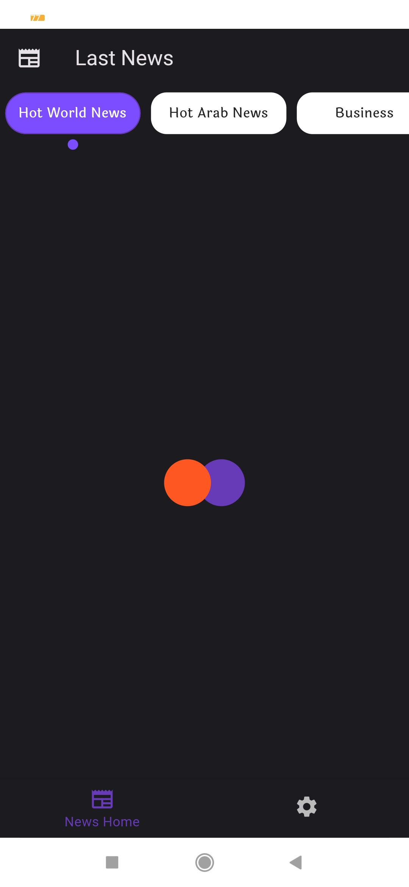 | 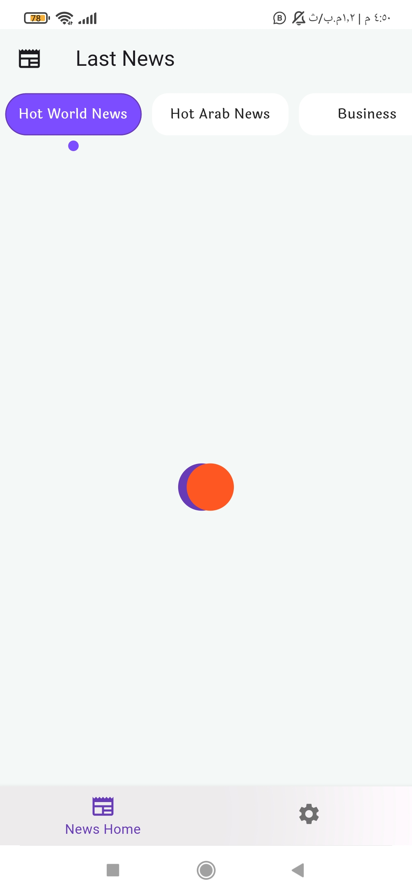 |
|  |  |
| 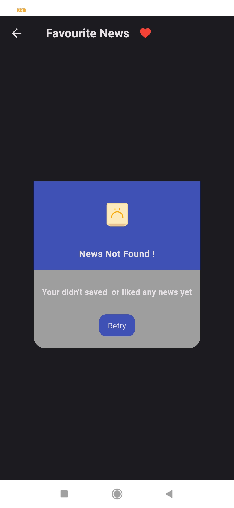 |  |
| 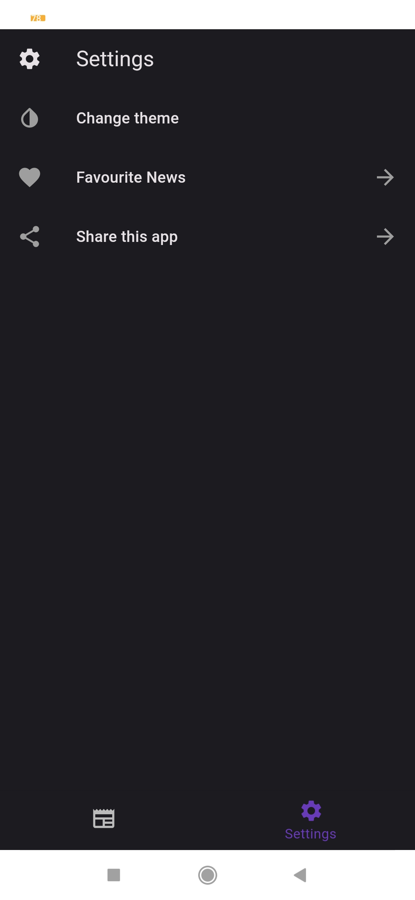 | 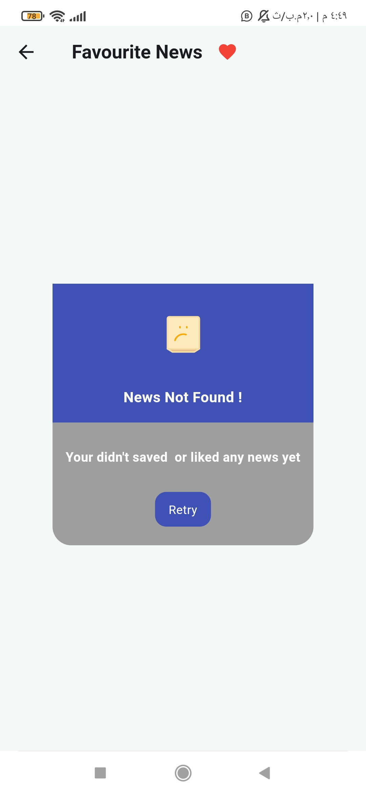 |
| 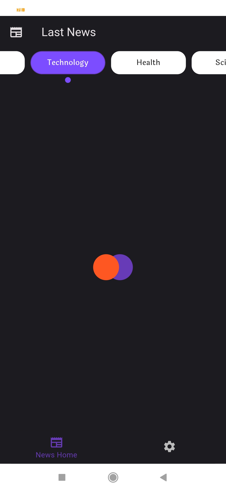 | 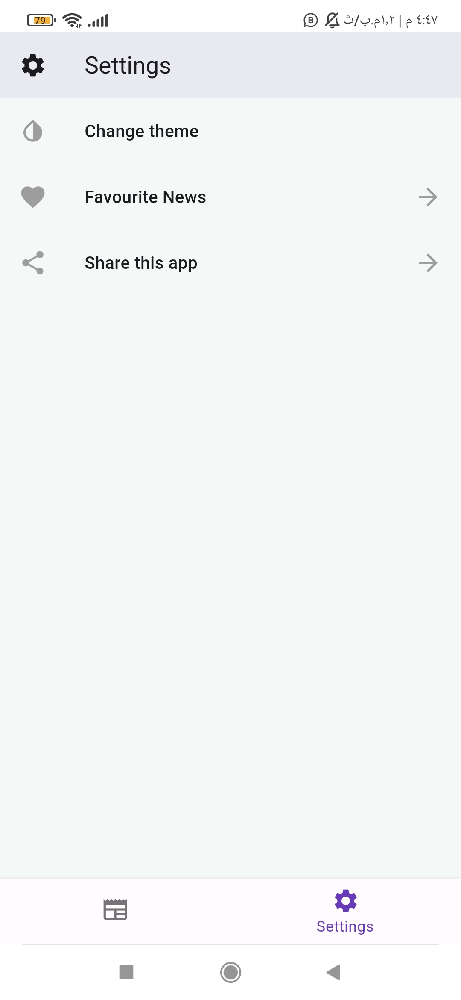 |
| 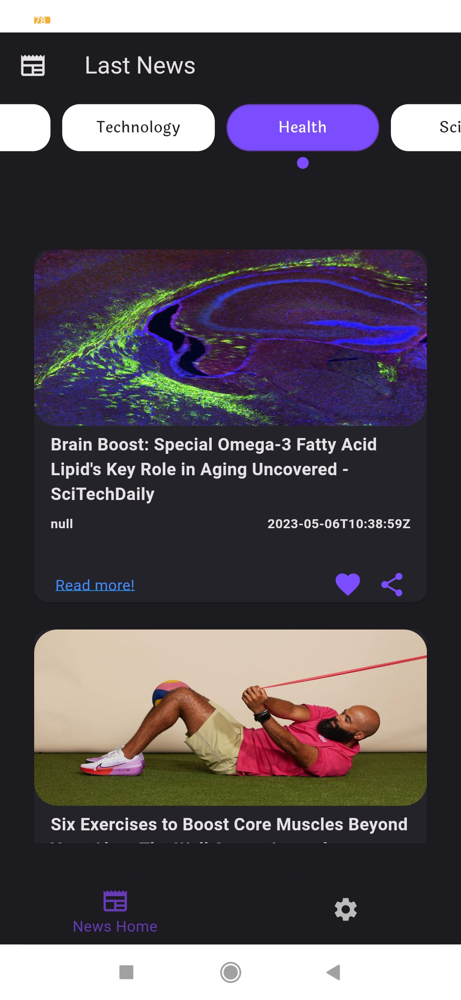 |  |
| 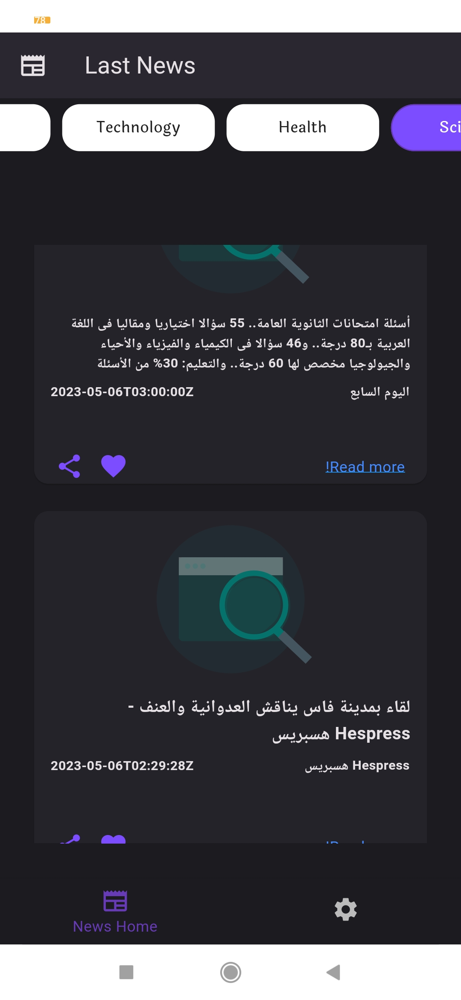 | 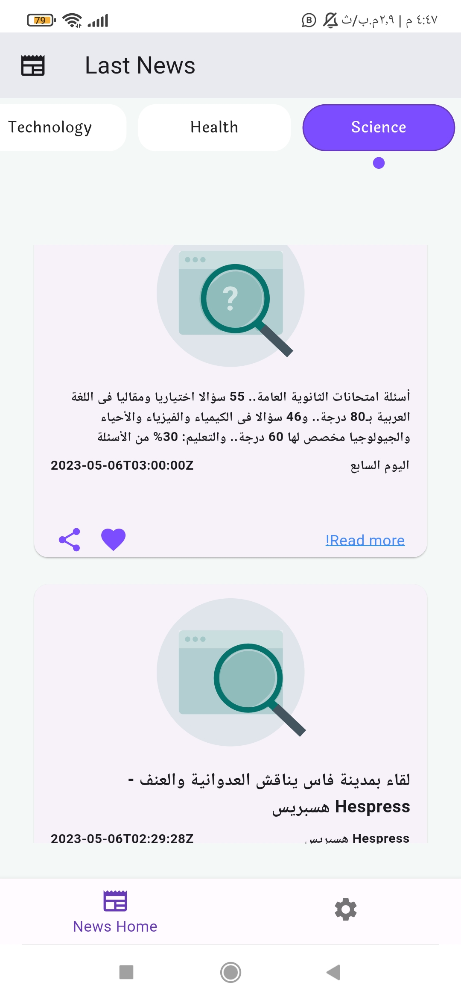 |
|  | 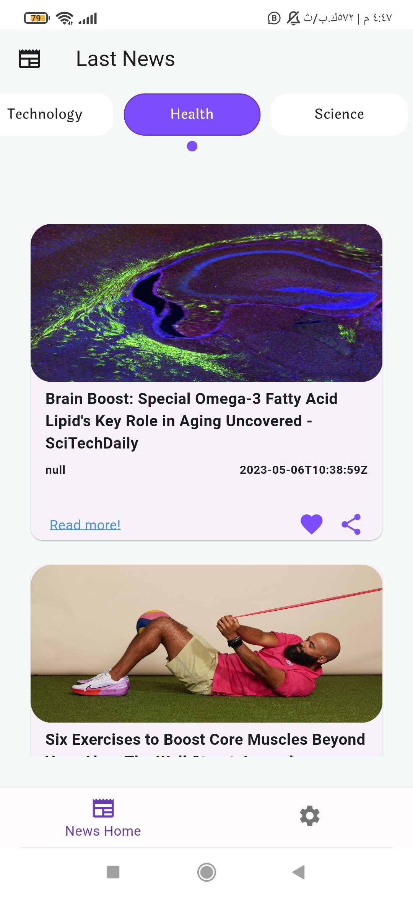 |
| 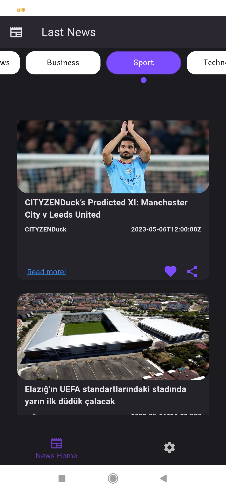 | 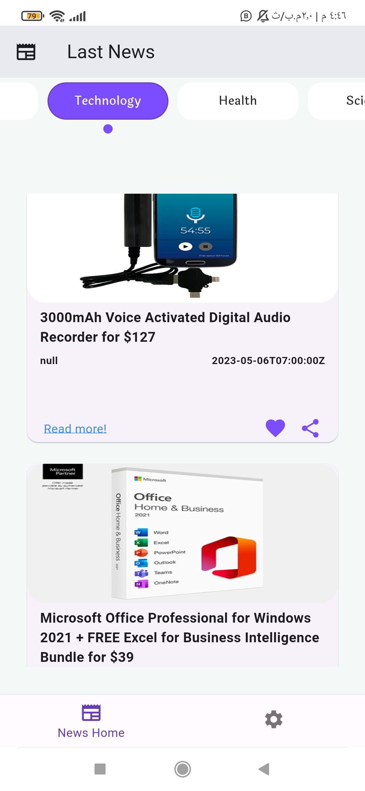 |
| 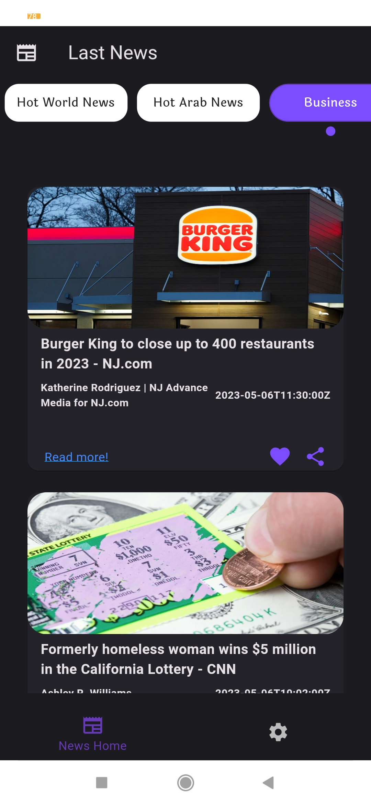 | 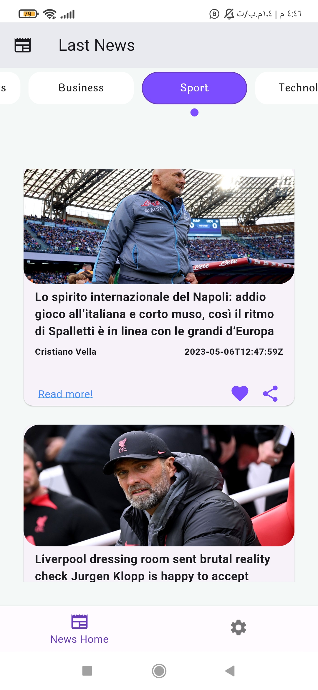 |
| 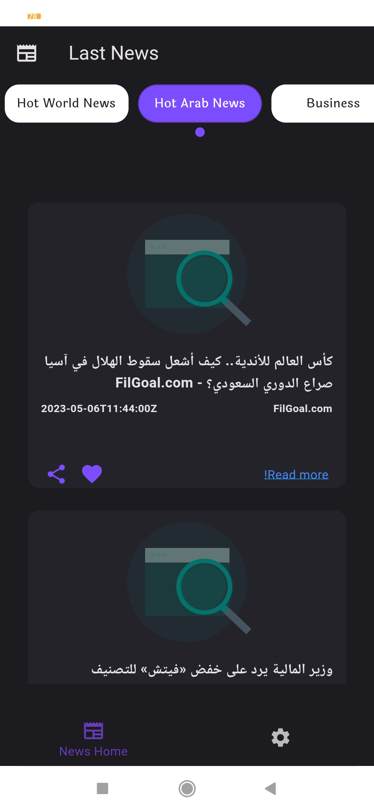 | 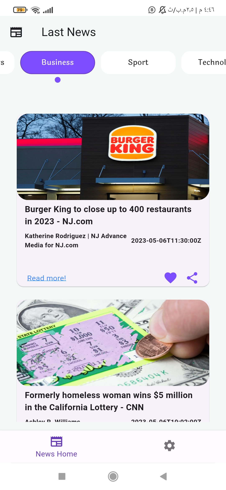 |

